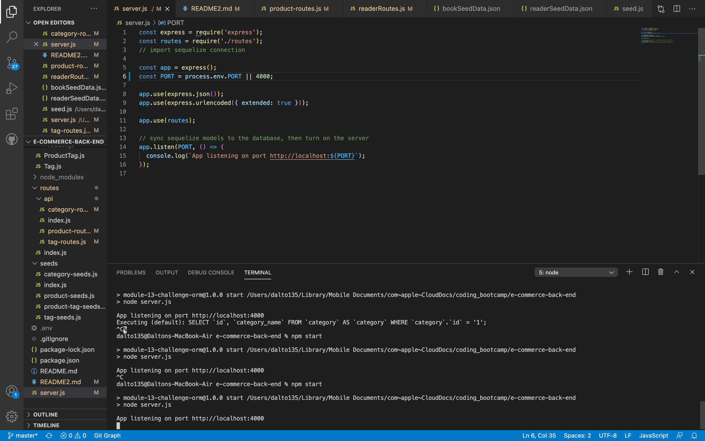
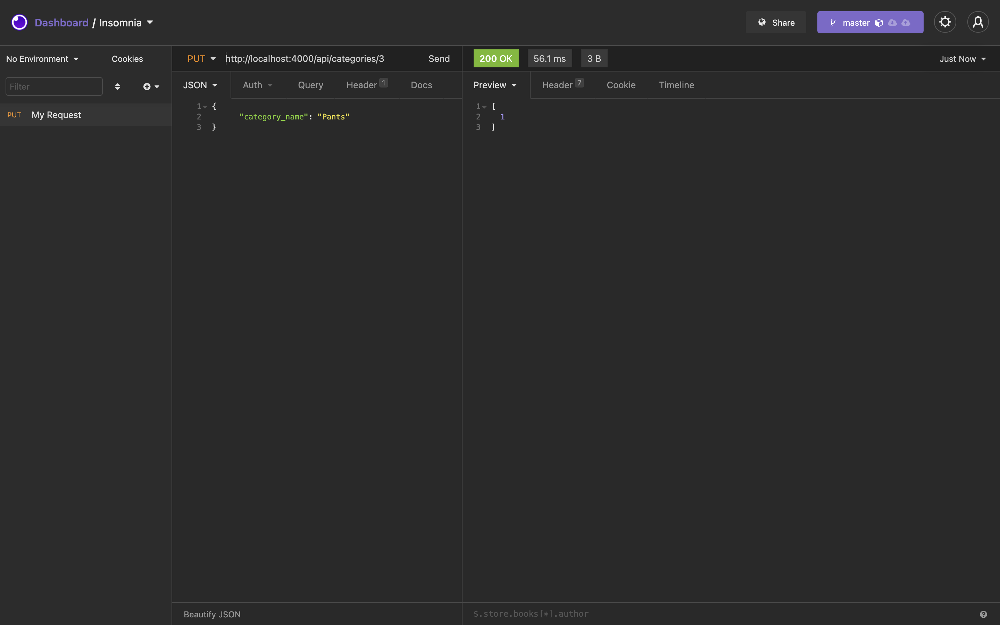

# E-Commerce Back End

## Table of Contents
[Video Link](#Link)  
[Technologies](#Technologies)  
[Description](#Description)  
[Screenshots](#Screenshots)  
[License](#License)  
[Contact](#Contact)

## Link
 https://drive.google.com/file/d/1cxDNCIwrB798FmN5aJWUSAKdSjxm2nXT/view

## Technologies
Javascript, Dotenv, Express, MYSQL2, Sequelize

## Description
A backend application using sequelize that allows users to view, create, update and delete items in a database of categories, products, tags, and product-tag associations. Individual items can be updated, deleted and viewed using item IDs.

## Screenshots

## License
MIT

## Contact
Dalton Wilkins - wilkins.271@osu.edu
